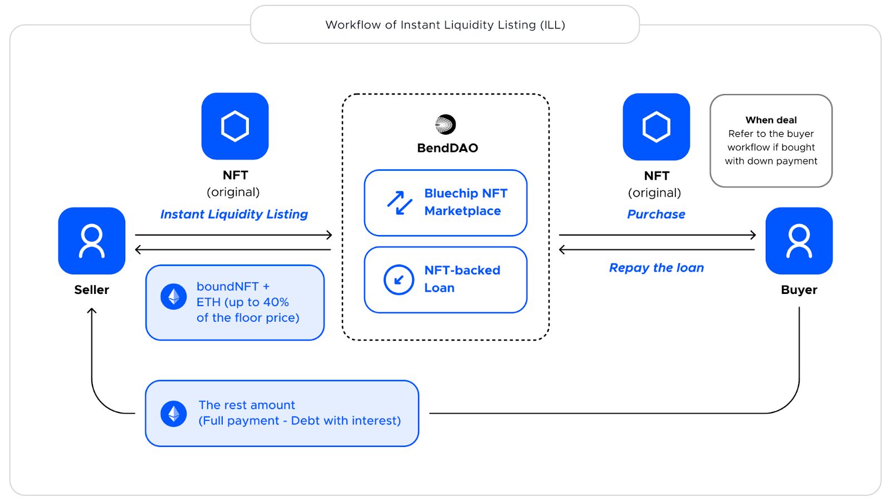

# BendDAO-analysis

https://github.com/cgq0123/bend-gitbook-portal/blob/chinese-v2/SUMMARY.md

## Liquidity Listing



### 卖方视角

通过抵押品挂单，NFT 持有人/卖家可以选择接受即时 NFT 支持的贷款，并在挂单时即时获得最高达 40% 的地板价。用户可以随时在 BendDAO 上挂单抵押品。

1. 卖家创建 Liquidity Listing
2. 挂单的同时获取最多 40% 该系列 NFT 地板价 的 eth 和 一个作为抵押品的 boundNFT
3. 卖家可以随时卖出抵押品 boundNFT
4. 买方将在交易后偿还包括利息在内的贷款。扣除债务与利息后的余额将在交易后转给借款人（卖方）
5. 卖方将获得的金额 = 总价 - 含息债务

### 买方视角

买家可以根据实际价格，支付最低为 60% 的首付来购买蓝筹 NFT，同时启动 AAVE 的闪电贷款来支付剩余部分。如果 NFT 的总价远远高于系列地板价，首付的比例会增加。闪电贷的借款金额将通过 BendDAO 上的即时 NFT 支持的贷款来偿还。

具体来说，BendDAO NFT 首付的流程如下。

1. 买家至少支付 60% 的首付款；
2. 启动闪电贷，从第三方平台（如 AAVE）借出剩余的资金；
3. 新购买的 NFT 将被用作 BendDAO 的抵押品以获得即时的流动性；
4. 该闪电贷将用从 BendDAO 借出的 ETH 来偿还。
5. 买家将在支付首付款时自动成为借款人。而借款人也可以在 BendDAO 市场上挂出他们抵押的 NFT 进行销售。

## boundNFT 的用途

1. 作为债务的 NFT：在借贷时被铸造，在偿还时被烧毁；
2. 通过不可转移和不可授权的方式保护 NFT 所有者免受黑客攻击；
3. 与用作 Twitter Blue PFP 同样的元数据；
4. 通过它获得任何空投、可领取的和可铸造的资产；

%20(1).png)

## 预言机

Bend 协议使用来自 OpenSea 和 LooksRare 的 NFT 地板价作为 NFT 抵押品的价格推送数据。Bend 协议只支持蓝筹 NFT 资产的地板价，用于链上价格推送。蓝筹 NFT 的地板价不容易被操纵。此外，Bend 协议计算地板价的 TWAP（时间加权均价），以过滤来自 OpenSea 和 LooksRare 交易市场的价格波动。

Bend 的预言机设计和运行机制：

1. 链下节点从 OpenSea 和 Looksrare 交易市场获得 NFT 的原始地板价；
2. 过滤原始地板价数据，如 Opensea 和 Lookrare 之间的地板价差异太大；
3. 根据 Opensea 和 Looksrare 的交易量计算出地板价；
4. 比较链上价格和最新地板价之间的差异，以决定是否需要将地板价上传到链上；
5. 调用合约接口，将地板价上传至链上合约，并计算链上时间加权平均价格（TWAP）以对地板价进行加权，确保价格合理；
6. twap 的算法在链上合约上是开源的，每个人都可以验证数据的有效性；


## 合约解析

https://docs.benddao.xyz/developers/


BendDAO 的协议包含两部分，分别是 Lending Protocol 包含了借贷相关的业务逻辑，Exchange Protocol 包含了交易相关的业务逻辑。

### Exchange Protocol

https://github.com/BendDAO/bend-exchange-protocol

Bend 交易所的核心合约是 BendExchange [0x7e832eC8ad6F66E6C9ECE63acD94516Dd7fC537A](https://etherscan.io/address/0x7e832eC8ad6F66E6C9ECE63acD94516Dd7fC537A)，它也是交易协议的主要入口点。大多数交互将通过 BendExchange 进行。

#### Order

Bend 交易所建立在混合系统（链下/链上）之上，该系统包含链下签名（称为 Maker Orders）和链上订单（称为 Taker Orders）。

* MakerBid——一种存在于链下的被动订单，用户希望使用特定的 ERC-20 代币获得 NFT。
* MakerAsk——一种存在于链下的被动订单，用户希望为特定的 ERC-20 代币出售 NFT。
* TakerBid — 在链上执行的与 MakerAsk 匹配的订单，例如，接受者接受 maker 的报价并为指定的 ERC-20 代币购买 NFT。
* TakerAsk — 在链上执行的与 MakerBid 匹配的订单，例如，接受者接受 maker 的报价并出售指定的 ERC-20 代币的 NFT。

##### Maker order

```solidity
struct MakerOrder {
        bool isOrderAsk; // true --> ask / false --> bid
        address maker; // maker of the maker order
        address collection; // collection address
        uint256 price; // The price of the order. The price is expressed in BigNumber based on the number of decimals of the “currency”. For Dutch auction, it is the minimum price at the end of the auction.
        uint256 tokenId; // id of the token,For collection orders, this field is not used in the execution and set it at 0.
        uint256 amount; // amount of tokens to sell/purchase (must be 1 for ERC721, 1+ for ERC1155)
        address strategy; // strategy for trade execution (e.g. StandardSaleForFixedPrice) 订单的执行策略
        address currency;
        uint256 nonce; // order nonce (must be unique unless new maker order is meant to override existing one e.g., lower ask price)
        uint256 startTime; // startTime in timestamp
        uint256 endTime; // endTime in timestamp
        uint256 minPercentageToAsk; // slippage protection， The minimum percentage required to be transferred to the ask or the trade is rejected (e.g., 8500 = 85% of the trade price).
        bytes params; // additional parameters, Can contain additional parameters that are not used for standard orders (e.g., maximum price for a Dutch auction, recipient address for a private sale, or a Merkle root... for future advanced order types!). If it doesn't, it is displayed "0x"
        address interceptor; // This field is only avaiable for ask order and used to execute specific logic before transferring the collection, For BNFT, it is used to repay the debt and redeeming the original NFT.
        bytes interceptorExtra; // Additional parameters when executing interceptor
        uint8 v; // v: parameter (27 or 28)
        bytes32 r; // r: parameter
        bytes32 s; // s: parameter
    }
```

##### Taker order

```solidity
struct TakerOrder {
        bool isOrderAsk; // true --> ask / false --> bid
        address taker; // msg.sender
        uint256 price; // final price for the purchase
        uint256 tokenId; // id of the token
        uint256 minPercentageToAsk; // // slippage protection
        bytes params; // other params (e.g., tokenId)
        address interceptor;
        bytes interceptorExtra;
    }
```

##### isOrderAsk

Ask 表示用户正在出售 NFT，而 Bid 表示用户正在购买 NFT（使用 WETH 等可替代货币）。

##### strategy

执行交易的执行策略地址。只有被 ExecutionManager 合约列入白名单的策略才能在 Bend 交易所中有效。如果执行策略未列入白名单，则交易不会发生。

##### currency

执行交易的货币地址。只有被 CurrencyManager 合约列入白名单的货币才能在 Bend 交易所中有效。如果货币未列入白名单，则无法进行交易。

##### minPercentageToAsk​

minPercentageToAsk 保护询问用户免受版税费用的潜在意外变化。当交易在链上执行时，如果平台总价格的特定百分比没有询问用户，交易将无法进行。

例如，如果 Alice 用 minPercentageToAsk = 8500 签署了她的收藏订单。如果协议费用为 2%，而版税更新为 16%，则该交易将无法在链上执行，因为 18% > 15 %。

##### params

此字段用于特定于不太频繁的复杂订单的附加参数（例如，私人销售、荷兰式拍卖和更复杂的订单类型）。附加参数集以字节表示，其中参数是连接在一起的。

##### interceptor（拦截器）

该字段仅对询单（ask order）可用，用于在转收之前执行特定的逻辑。比如对于BNFT，用于偿还债务和赎回原始NFT。

#### 成单方法

##### matchAskWithTakerBid

撮合成交一个卖单。

订单成交后悔发出 `TakerBid` 的事件。

```solidity
function matchAskWithTakerBid(
        OrderTypes.TakerOrder calldata takerBid,
        OrderTypes.MakerOrder calldata makerAsk
    ) external payable override nonReentrant
```

##### matchAskWithTakerBidUsingETHAndWETH

撮合成交一个以 eth 支付的卖单。

订单成交后悔发出 `TakerBid` 的事件。

```solidity
function matchAskWithTakerBidUsingETHAndWETH(
        OrderTypes.TakerOrder calldata takerBid,
        OrderTypes.MakerOrder calldata makerAsk
    )
```

##### matchBidWithTakerAsk

撮合成交一个买单。

订单成交后悔发出 `TakerAsk` 的事件。

```solidity
function matchBidWithTakerAsk(OrderTypes.TakerOrder calldata takerAsk, OrderTypes.MakerOrder calldata makerBid)
        external
        override
        nonReentrant
```

#### 事件

卖单成交后发出的事件。

```solidity
event TakerAsk(
        bytes32 makerOrderHash, // bid hash of the maker order
        uint256 orderNonce, // user order nonce
        address indexed taker, // sender address for the taker ask order
        address indexed maker, // maker address of the initial bid order
        address indexed strategy, // strategy that defines the execution
        address currency, // currency address
        address collection, // collection address
        uint256 tokenId, // tokenId transferred
        uint256 amount, // amount of tokens transferred
        uint256 price // final transacted price
    );
```

买单成交后发出的事件。

```solidity
event TakerBid(
        bytes32 makerOrderHash, // ask hash of the maker order
        uint256 orderNonce, // user order nonce
        address indexed taker, // sender address for the taker bid order
        address indexed maker, // maker address of the initial ask order
        address indexed strategy, // strategy that defines the execution
        address currency, // currency address
        address collection, // collection address
        uint256 tokenId, // tokenId transferred
        uint256 amount, // amount of tokens transferred
        uint256 price // final transacted price
    );
```

#### Execution Strategy（执行策略）

每个订单中都有 strategy 这个属性，来描述订单具体的执行策略对应的合约的地址。

在成单方法中会调用指定的 strategy 的 `canExecuteTakerAsk()` 或者 `canExecuteTakerBid()` 方法来检查是否符合指定的策略。

BendExchange 合约有个属性 executionManager 就是用来管理所有执行策略的。

##### 1. StrategyStandardSaleForFixedPrice

以固定价格执行订单的策略，可以通过买盘或卖盘来执行。

canExecuteTaker 方法会校验价格，token id 以及订单的时间。

##### 2. StrategyPrivateSale

与上面的策略类似，不同的是 StrategyPrivateSale 策略的订单额外通过订单的 params 指定 接收者的地址。

##### 3. StrategyDutchAuction

拍卖的时候执行的策略。会根据时间计算出当前价价格 currentAuctionPrice。

需要注意的是该策略只有 `canExecuteTakerAsk()` 方法永远返回 false 。

##### 4. StrategyAnyItemInASetForFixedPrice

以固定价格发送订单的策略，可由一组 tokenIds 中的任何 tokenId 匹配。

与 Seaport 中基于标准的订单一样，都是通过 Merkle Tree 来实现具体的逻辑的。

##### 5. StrategyAnyItemFromCollectionForFixedPrice

以固定价格发送订单的策略，该订单可由集合的任何 tokenId 匹配。

同样类似于 Seaport 中基于标准的订单中不指定具体的 tokenId。

#### AuthorizationManager

用于注册授权代理，每个用户都有自己独立的代理。类似于 Wyvern Protocol。

用户将自己的资产授权给生成的代理合约。然后具体执行的时候由代理合约进行资产转移。

#### CurrencyManager

它允许添加/删除用于在 Bend 交易所进行交易的货币。

### Lending Protocol

https://github.com/BendDAO/bend-lending-protocol

LendPool 是 Bend 借贷协议的主要入口。与 Bend 的大多数借贷相关交互将通过 LendPool 进行。


### Down Payment

https://github.com/BendDAO/bend-downpayment

